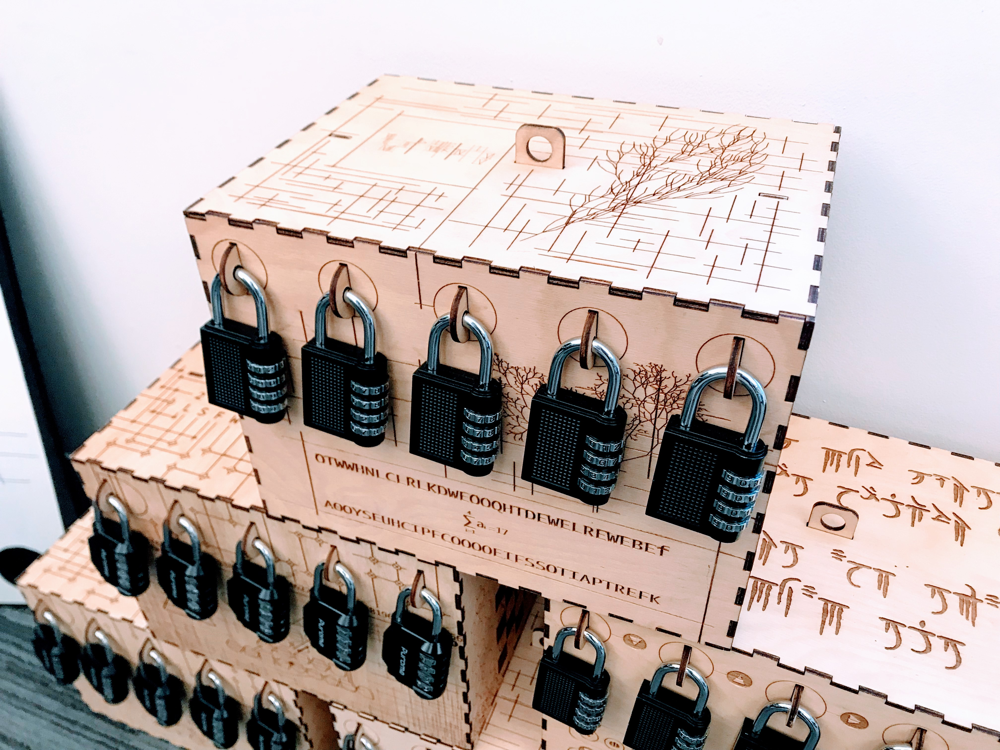

# DanGetRekt #
Masterminds <b>Joe McCann, Mahamadou Juwara JR, Sophie Zheng, Nathan Zhu</b>.

A Puzzles website made by the Arena Team in response to Dan's puzzle box challenge.  This puzzle is designed to be an intensely frustrating exercise in futility.

 

 
 

## Installation ##
We used create-react-app as a basis of our application.
### Client Installation ###
Please visit our site at 'https://sophiezheng0711.github.io/DanGetRekt/'. No installation is required. For your user experience, please do not attempt to look through our src code to find the answer to the puzzles. This will take out the fun of the puzzles and ruin the game for both you and other users. Thank you, and have fun!
### Admin Installation ###
First, clone the master branch of our repository to your laptop using command 'git clone https://github.com/sophiezheng0711/DanGetRekt'.
Then, change directory to '.../DanGetRekt/puzzles' on your laptop, and run 'npm install'. Note that installation of Node and npm are required.

## Run ##
After missing packages are installed, run 'npm start'.

## Deployment ##
Every time you make changes to the master branch of the repo, make sure your local copy is up-to-date and run 'npm run deploy' to update the server. If README.md shows up instead (this file), wait a couple of minutes and check back again.
